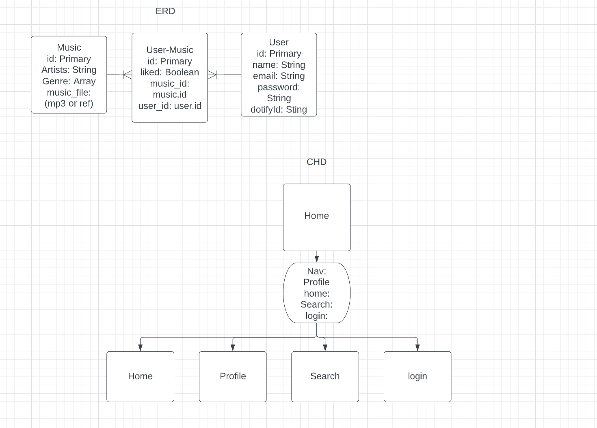

# Dotify

Created By: Justin Junious

### **_Description_**

This application will be a music player service similar to Spotify. You will have the ability to register to the site.

From there music will became available to you. This will be searchable, playable and likeable(maybe!)

I would like to add functionality for you to create a play list of music based on like songs. Then you will be able to play your playlists.

### **_Technologies Used_**

For now these are the expected technology I will use.

- React
- Postgres
- Sequelize
- Node.js
- Express.js
- Javascript
- Html
- Css
- Heroku

#### [Heroku Deployment]()

#### **_ERD, CHD & Trello_**

We used this diagram as a reference to understand user experience and how the database would connect/flow.
Feel free to modify this and make your own.

[Hierarchy & ERD](https://lucid.app/lucidchart/633e4ccb-ac2c-406e-b8b0-5c689a99b561/edit?beaconFlowId=ACE688B68C8B05D8&invitationId=inv_f887054e-6b1d-4ec8-ba9e-d346e1411f18&page=0_0#)

Here is a link to the [Trello Board](https://trello.com/invite/b/mKGbJMBE/ATTI6142ff4de250acc3d83cc2b3012d32d891723CD3/dotify-project). This is what I used to plan out how I will build this application.

### **_Getting Started_**

### **_Future Updates_**
